# Проектная работа «Обучалка английскому языку» (чат-бот Telegram)

## Описание проекта

### Цель проекта

Разработка базы данных Telegram-бота для изучения английского языка.

### Вводные параметры

- ```DB_NAME```: название базы данных в Postgres
- ```DB_USER```: имя пользователя Postgres
- ```DB_PASSWORD```: пароль пользователя Postgres
- ```TG_TOKEN```: токен для подключения к чат-боту Telegram
- ```TEST_DB_NAME```: название тестовой базы данных в Postgres (для работы в разрезе модуля ```test.py```)

### Ожидаемый результат

Запуск чат-бота Telegram, обучающего пользователя английскому языку. В процессе работы программы обучающие могут осуществить одно из следующих возможных действий:

- выбор одного из четырех вариантов перевода английского слова нажатием клавиши
- добавление английского слова в персональную базу данных (БД) пользователя Telegram нажатием клавиши "Добавить слово"
- удаление английского слова из персональной БД пользователя Telegram нажатием клавиши "Удалить слово"

### На какой версии Python выполнен проект?

Проект выполнен на Python 3.9.10 в PyCharm CE (64-bit, Linux Ubuntu). Код для запуска чат-бота находится в модуле ```main.py```, а библиотеки для установки - в файле ```requirements.txt```.

### Что следует сделать перед запуском программы?

Перед запуском кода следует удостовериться, что:
- заведен проект в IDE
- размещены все файлы в папке с проектом
- установлены все библиотеки, указанные в ```requirements.txt```
- заполнены все сведения, содержащиеся в файле ```.env```

## Структура проекта

```
data/
├─ database_csv/
│  ├─ database.csv
├─ eng_audio_files_mp3/
│  ├─ file.mp3

database/
├─ schema/
│  ├─ schema.png
├─ __init__.py
├─ creation.py
├─ repository.py
├─ structure.py

tests/
├─ __init__.py
├─ test.py

tgbot/
├─ instruction/
│  ├─ instruction.png
├─ __init__.py
├─ connection.py
├─ functionality.py
├─ parsing.py

.env
.gitignore

filefinder.py
main.py

README.md
requirements.txt
```

- `data`: папка с данными, относительно которых формируется БД в Postgres:
  - `database_csv`: папка, содержащая CSV-файл с 4000 уникальными английскими словами (`database.csv`)
    - относительно `database.csv` заполняется первоначальная БД в Postgres
    - данные, содержащиеся в csv-файле, были получены посредством парсинга сайтов (см. [ветку data](https://github.com/maxter9595/EngStudyBot/tree/data 'Ветка data') текущего репозитория)
  - `eng_audio_files_mp3`: папка, включающая MP3-файлы с произношением английских слов
    - MP3-файлы запускаются в чат-боте


- `database`: пакет с модулями, ориентированными на работу с БД в Postgres
  - `schema`: папка, содержащая схему БД (```schema.png```)
  - `creation.py`: модуль, нацеленный на формирование БД и таблиц
  - `repository.py`: модуль, содержащий фукнционал по работе с репозиторием
  - `structure.py`: модуль, отвечающий за построение структуры таблиц


- `tests`: пакет, направленный на тестирование функционала приложения
  - `test.py`: модуль, отвечающий за тест функционала приложения


- `tgbot`: пакет с модулями, затрагивающими работу чат-бота Telegram
  - `instruction`: папка, содержащая скриншоты работы с чат-ботом
  - `connection.py`: модуль, нацеленный на подключение к чат-боту
  - `functionality.py`: модуль, отвечающий за функционал чат-бота
  - `parsing.py`: модуль, отвечающий за парсинг данных с сайтов для чат-бота


- `.env`: файл, в котором заполняются все необходимые данные для подключения к чат-боту Телеграм и БД Postgres
  - `filefinder.py`: модуль, отвечающий за поиск файлов и папок внутри проекта
  - `main.py`: файл, обобщающий весь функционал проекта
  - `requirements.txt`: файл с библиотеками, требующими установки

## Схема БД

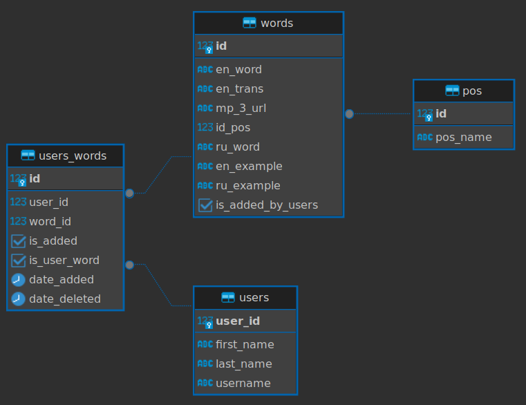

- **`pos`**: таблица с частями речи английских слов
  - `id`: ID части речи
  - `pos_name`: наименование части речи


- **`words`**: таблица с данными английских слов
  - `id`: ID английского слова
  - `en_word`: английское слово
  - `en_trans`: транскрипция английского слова
  - `mp_3_url`: URL-ссылка на MP3-файл с произношением слова
  - `id_pos`: ID части речи английского слова
  - `ru_word`: перевод английского слова
  - `en_example`: предожение с использованием английского слова
  - `ru_example`: предожение с использованием перевода
  - `is_added_by_users`: факт добавления слова пользователями
    - `True` - слово добавлено одним из пользователей
    - `False` - слово добавлено разработчиком приложения


- **`users`**: таблица с пользователями приложения
  - `user_id`: Telegram ID пользователя
  - `first_name`: имя пользователя
  - `last_name`: фамилия пользователя
  - `username`: профиль пользователя в Telegram


- **`users_words`**: таблица, связывающая пользователей со словами
  - `id`: ID пары "пользователь-слово"
  - `user_id`: Telegram ID пользователя
  - `word_id`: ID слова из таблицы words
  - `is_added`: факт добавления слова в личную БД пользователя
    - `True` - слово добавлено в личную БД пользователя
    - `False` - слово убрано из личной БД пользователя
  - `is_user_word`: факт добавления слова пользователем
    - `True` - слово добавлено конкретным пользователем
    - `False` - слово добавлено разработчиком приложения
  - `date_added`: дата добавления пользователем слова в личную БД
  - `date_deleted`: дата удаления пользователем слова из личной БД

## Запуск программы

Для включения программы необходимо:
- заполнить все сведения в файле `.env`
  - `DB_NAME`: название БД в Postgres
  - `TEST_DB_NAME`: название тестовой БД в Postgres
  - `DB_USER`: имя пользователя Postgres, относительно которого формируется БД
  - `DB_PASSWORD`: пароль пользователя Postgres
  - `TG_TOKEN`: токен для подключения к чат-боту Telegram


- запустить модуль `main.py`


- после появления фразы ```ПОДКЛЮЧЕНИЕ К ЧАТ-БОТУ...``` можно начинать взаимодествие с чат-ботом Telegram


При желании можно запустить модуль `test.py` для тестирования функционала приложения


```dotenv
DB_NAME='EngStudyBot'
TEST_DB_NAME='TestEngStudyBot'
DB_USER='postgres'
DB_PASSWORD='postgres'
TG_TOKEN='1010101010:AAAaaaAAaaaa1aAaAaAAAaAA-aaAAAaAaO1'
```

## Инструкция по работе с чат-ботом Telegram

### Запуск чат-бота

- После подключения к чат-боту Telegram нажимаем на клавишу `Start`

&nbsp;


- Отгадываем правильный перевод английского слова
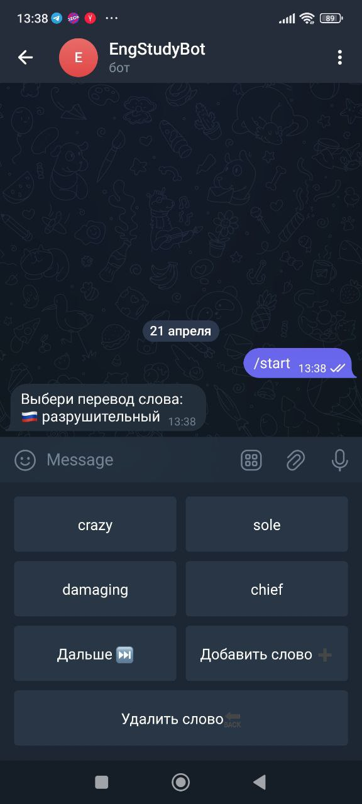
&nbsp;


---------------------

### Выбор варианта ответа и клавиша "Дальше"

- При выборе неправильного варианта ответа появится крестик

&nbsp;


- При выборе корректного варианта ответа появится сообщение о верном ответе
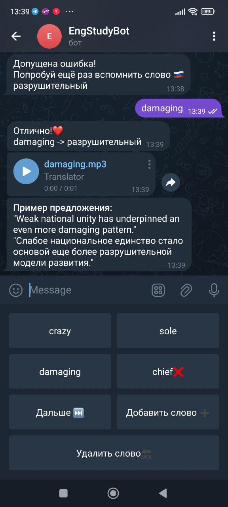
&nbsp;


- Для продолжения пользователем нажимается клавиша `"Дальше"`
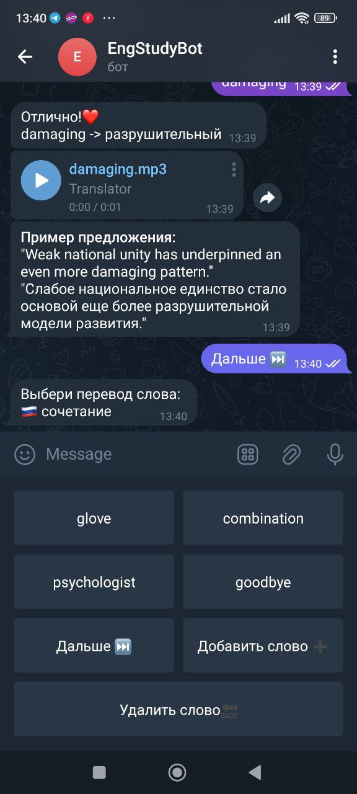
&nbsp;


---------------------

### Клавиша "Добавить слово"

- После нажатия на клавишу `"Добавить слово"` чат-бот просит пользователя ввести английское слово, которое необходимо добавить в собственную БД
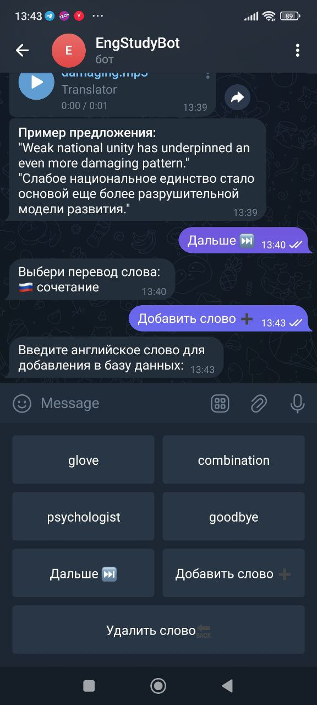
&nbsp;


- При добавлении существующего слова чат-бот сообщит о его наличии в базе данных пользователя
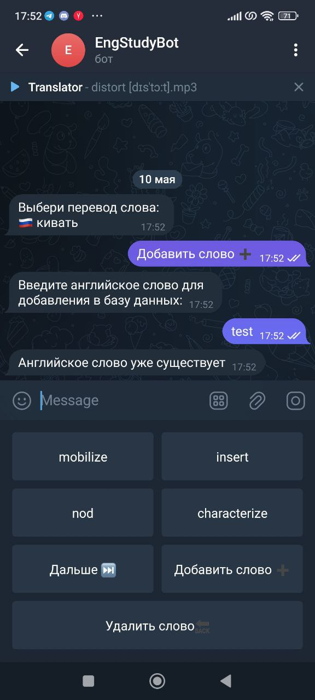
&nbsp;


- Непредусмотренное нажатие клавиш, содержащих команды `"Дальше"`, `"Добавить слово"` и `"Удалить слово"`, приводит к невозможности обработки их чат-ботом
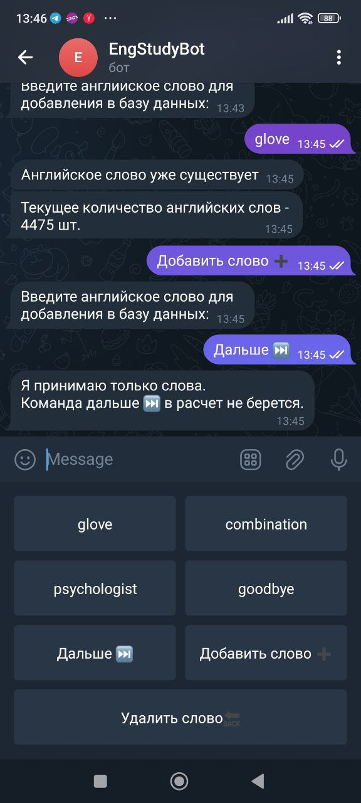
&nbsp;


- При вводе нового английского слова, существующего в БД онлайн-словарей (Oxford, Promt.One), чат-бот автоматически добавляет его в БД пользователя Telegram
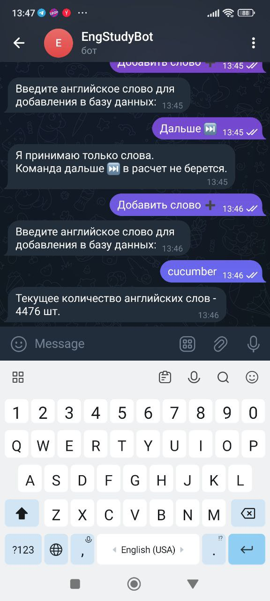
&nbsp;


- При вводе нового английского слова, отсутствующего в БД онлайн-словарей (Oxford, Promt.One), чат-бот просит пользователя ввести перевод английского слова
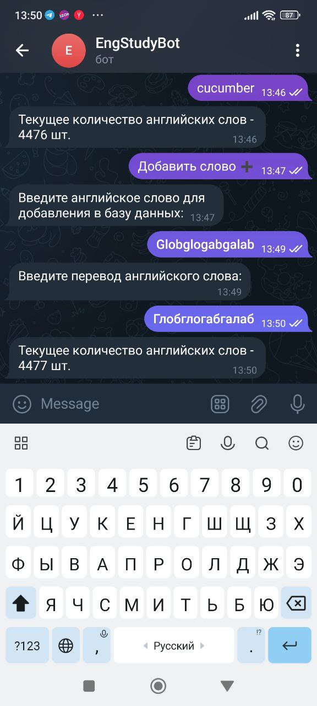
&nbsp;


- При вводе русского слова вместо английского чат-бот просит пользователя Telegram нажать на клавишу `Добавить слово` и повторить попытку
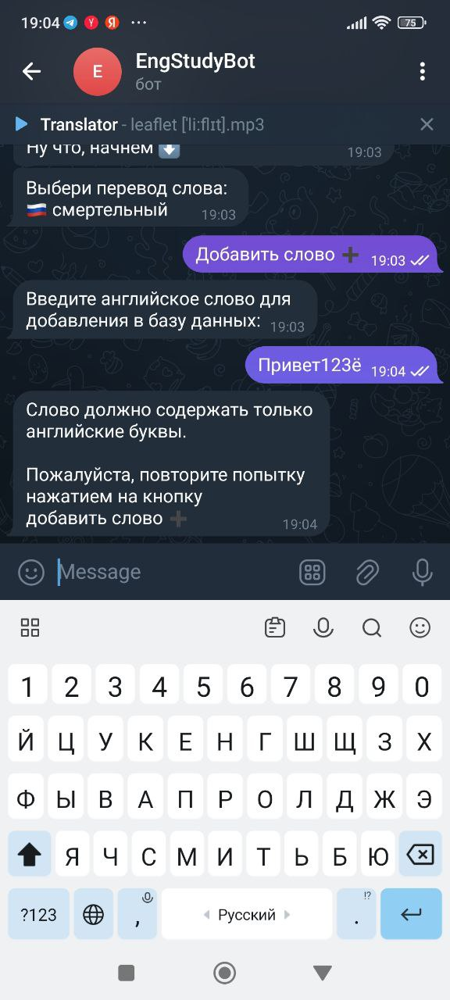
&nbsp;


- При вводе английского слова вместо русского чат-бот просит пользователя Telegram нажать на клавишу `Добавить слово` и повторить попытку
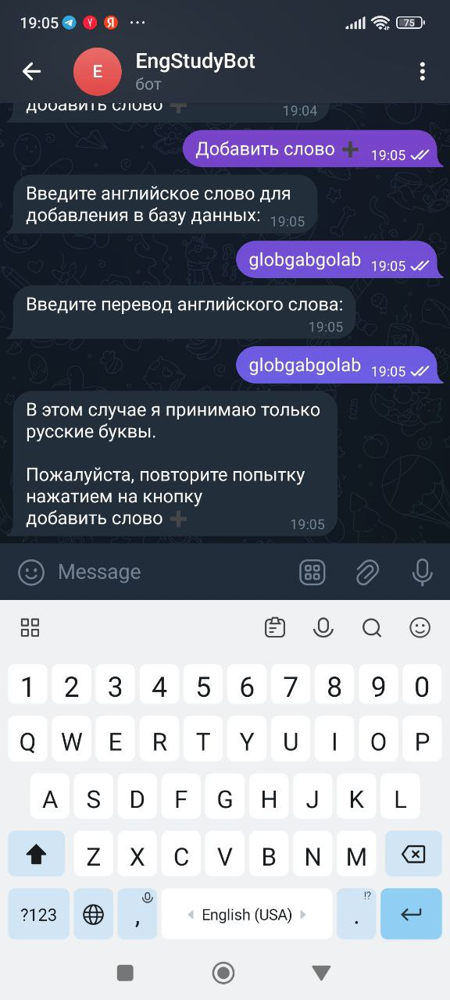
&nbsp;


---------------------

### Клавиша "Удалить слово"

- Для удаления английского слова из БД пользователя Telegram необходимо нажать на клавишу `"Удалить слово"`
&nbsp;


- Непредусмотренное нажатие клавиш, содержащих команды `"Дальше"`, `"Добавить слово"` и `"Удалить слово"`, приводит к невозможности обработки их чат-ботом
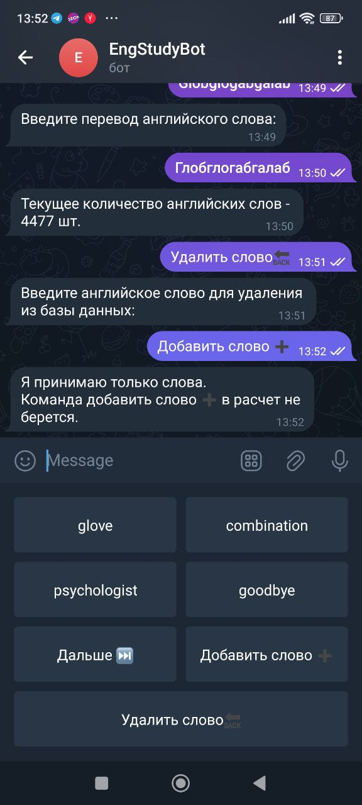
&nbsp;


- При отсутствии английского слова в БД пользователя Telegram чат-бот извещает его о невозможности выполнить запрошенную операцию
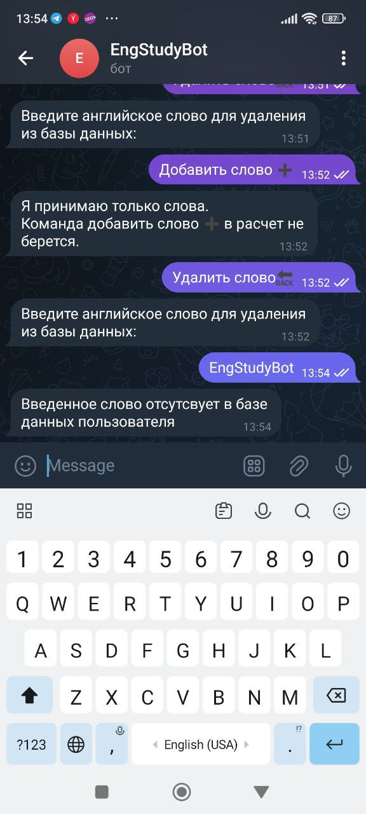
&nbsp;


- При наличии введенного английского слова в БД пользователя Telegram чат-бот удаляет его
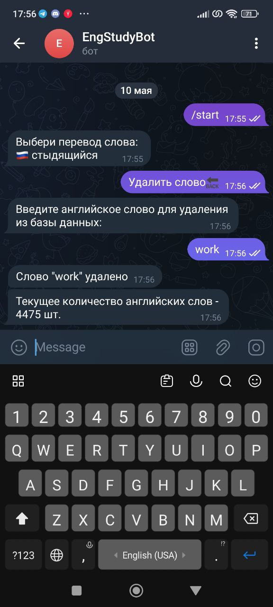
&nbsp;


- При вводе русского слова вместо английского чат-бот просит пользователя Telegram нажать на клавишу `Удалить слово` и повторить попытку
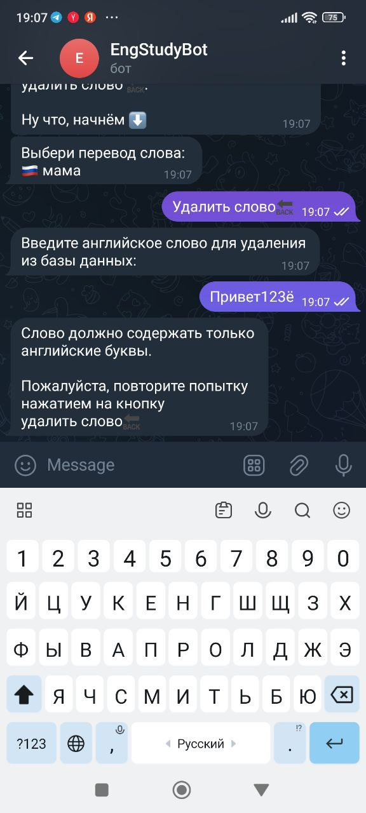
&nbsp;
