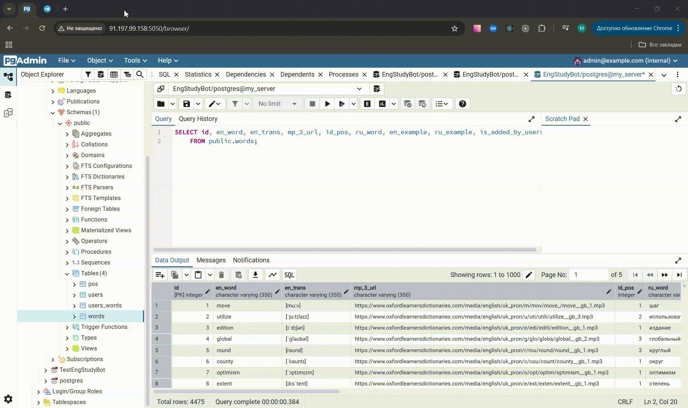
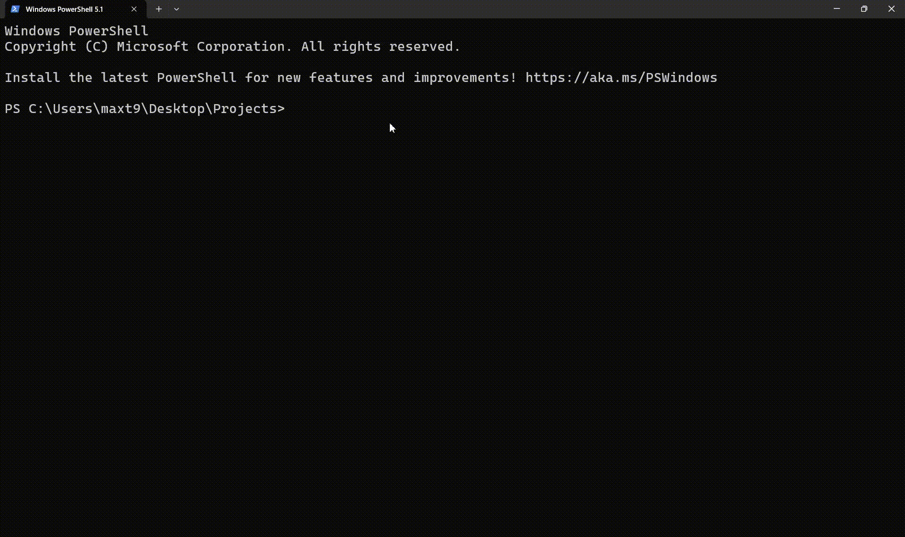
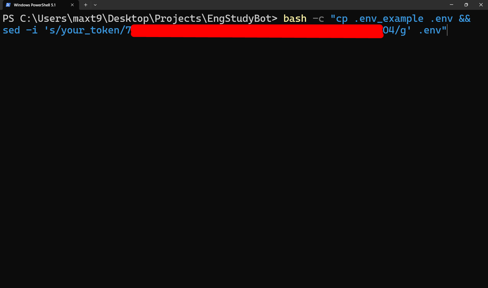
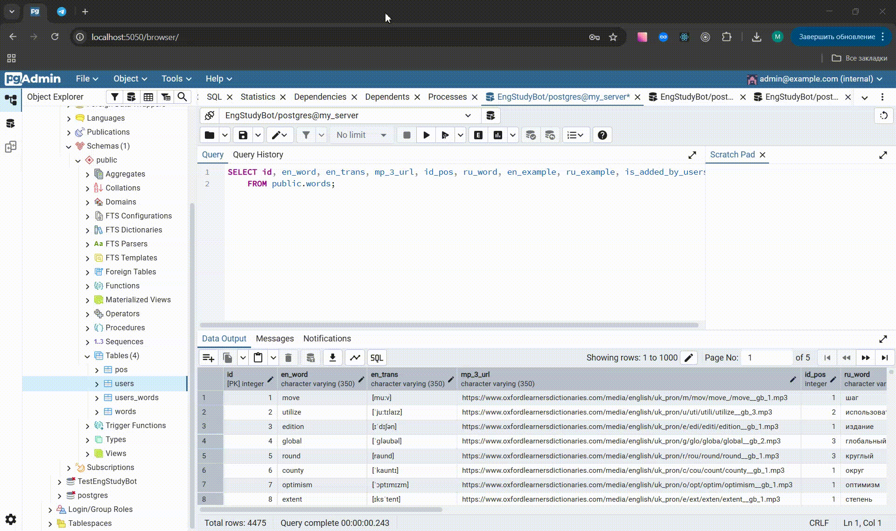

# 📚 EngStudyBot - Telegram-бот для изучения английского языка


## 1. Лимиты внешних API и прочие ограничения

### Oxford Dictionary
- **Аудио**: запись произношения (MP3) доступна не для всех слов. В некоторых случаях бот не сможет найти или скачать аудио.  
- **Частота запросов**: слишком интенсивный парсинг может привести к блокировке IP-адреса. В скрипте реализованы задержки между запросами для снижения риска блокировки.  

### Promt
- **Качество перевода**: переводы и примеры предложений формируются автоматизированным сервисом, поэтому могут содержать стилистические неточности.
- **Определение частей речи**: алгоритм иногда ошибается при работе с многозначными словами или сложными грамматическими случаями.  

### Telegram
- **Размер сообщений**: длина одного сообщения (включая текст и примеры предложений) не должна превышать **4096 символов**.  
- **Размер аудиофайлов**: загружаемые MP3-файлы не должны превышать **50 МБ** (ограничение Telegram API).  

### Прочие ограничения
- **Поддерживаемые части речи**: бот обрабатывает только ществительные (*noun*), глаголы (*verb*) и прилагательные (*adjective*). Остальные слова помечаются как *unidentified*.  
- **Спецсимволы**: в словах недопустимы `<, >, :, ", /, \, |, ?, *`. При создании имени аудиофайла они автоматически удаляются.  
- **Регистр букв**: при вводе слов для добавления или удаления регистр не имеет значения (все слова приводятся к нижнему регистру).  


## 2. Особенности работы приложения

### 2.1. Запуск чат-бота

- После подключения к чат-боту Telegram нажимаем на клавишу ```Start```
- Отгадываем правильный перевод английского слова



### 2.2. Выбор варианта ответа и клавиша "Дальше"

- При выборе неправильного варианта ответа появится крестик
- При выборе корректного варианта ответа появится сообщение о верном ответе
- Для продолжения пользователем нажимается клавиша "Дальше"


### 2.3. Клавиша "Добавить слово"

- После нажатия на клавишу "Добавить слово" чат-бот просит пользователя ввести английское слово, которое необходимо добавить в собственную БД
- Непредусмотренное нажатие клавиш, содержащих команды "Дальше", "Добавить слово" и "Удалить слово", приводит к невозможности обработки их чат-ботом
- При добавлении существующего слова чат-бот сообщит о его наличии в базе данных пользователя


- При вводе нового английского слова, существующего в БД онлайн-словарей (Oxford, Promt.One), чат-бот автоматически добавляет его в БД пользователя Telegram
- При вводе нового английского слова, отсутствующего в БД онлайн-словарей, чат-бот просит пользователя ввести перевод английского слова


- При вводе русского слова вместо английского чат-бот просит пользователя Telegram нажать на клавишу Добавить слово и повторить попытку
- При вводе английского слова вместо русского чат-бот просит пользователя Telegram нажать на клавишу Добавить слово и повторить попытку


### 2.4. Клавиша "Удалить слово"

- Для удаления английского слова из БД пользователя Telegram необходимо нажать на клавишу "Удалить слово"
- Непредусмотренное нажатие клавиш, содержащих команды "Дальше", "Добавить слово" и "Удалить слово", приводит к невозможности обработки их чат-ботом
- При отсутствии английского слова в БД пользователя Telegram чат-бот извещает его о невозможности выполнить запрошенную операцию


- При наличии введенного английского слова в БД пользователя Telegram чат-бот удаляет его
- При вводе русского слова вместо английского чат-бот просит пользователя Telegram нажать на клавишу Удалить слово и повторить попытку


## 3. Инструкция по локальному запуску проекта

### 3.1. Клонирование репозитория

* Клонирование репозитория:

```bash
git clone https://github.com/maxter9595/EngStudyBot.git
cd EngStudyBot
```



### 3.2. Настройка переменных окружения с установкой валидного Telegram-токена

* Документация по Telegram Bot API: [https://core.telegram.org/bots/api](https://core.telegram.org/bots/api)

* Копирование переменных окружения с заменой значения переменной ```TG_TOKEN``` на валидный Telegram-токен:

```bash
# 7...O4 - Telegram-токен, заменяющий your_token
bash -c "cp .env_example .env && sed -i 's/your_token/7...O4/g' .env"
```



### 3.3. Запуск Docker

* Запуск Docker Desktop. Его наличие необходимо

* Сборка и запуск Docker:

```bash
docker compose build
docker compose up -d
```


### 3.4. Тестирование приложения

* Проверка наличия Docker-контейнеров и запуск тестирования функционала приложения:

```bash
docker-compose ps
docker-compose run test
```


### 3.5. Подключение к административной панели СУБД PostgreSQL

* Ссылка для подключения: [http://localhost:5050/](http://localhost:5050/)

* Данные администратора БД для входа в административную панель PostgreSQL:

```
Почта: admin@example.com
Пароль: admin123
```

* `Register...` ➝ `Server...`. Данные соединения:

```
Host: db
Port: 5432
Maintenance database: EngStudyBot
Username: postgres
Password: postgres
```


### 3.6. Открытие приложения

* Смотрим на работу Telegram-бота



## 4. Инструкция по деплою проекта на сервере

### 4.1. Покупка сервера и подключение к нему

* Рег.RU - Облачный сервер с предустановленным Docker: [https://www.reg.ru/cloud/docker](https://www.reg.ru/cloud/docker)

* Пример IP-адреса и информация о сервере для покупки:

```
- Предустановленный Docker: да 
- Образ: Ubuntu
- Тарифы и конфигурации: производительный
- Тариф: HP C2-M2-D40
- Регион размещения: Москва
- Плавающий (публичный) IP-адрес: да
- Резервное копирование: да
```

* Вход на сервер после его приобретения:

```bash
# Входим по IP и паролю, выданными на почту
ssh root@
```
